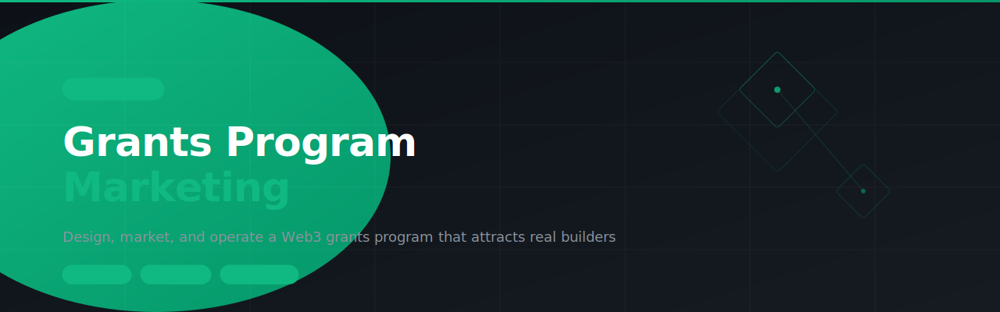

# grants-program-marketing



> SKILL.md for AI agents — Design, market, and operate a Web3 grants program that attracts real builders. Covers program positioning, applicant acquisition, review frameworks, communications, and impact reporting.

---

## Install

```
clawhub skill install grants-program-marketing
```

Or paste the repo URL directly into your OpenClaw chat and the agent will install it automatically.

---

## What it does

5 modules, all in one skill:

| Module | What it solves |
| --- | --- |
| **Program Design & Positioning** | Grant tiers, positioning statement, grants page copy structure |
| **Applicant Acquisition** | Channel strategy to attract builders via X, Discord, LinkedIn, and direct outreach |
| **Application Review Framework** | Scorecard, red flags, and interview questions for shortlisted teams |
| **Communications & Announcements** | Launch threads, results announcements, and grantee spotlight templates |
| **Impact Reporting** | End-of-round reports and DAO transparency docs |

---

## Who it's for

DAO contributors, protocol marketing leads, and grants committee members running programs that need to attract signal, not noise.

---

## File structure

```
grants-program-marketing/
└── SKILL.md    ← Full skill (5 modules)
```

---

## Built with

- [OpenClaw](https://openclaw.ai)
- [ClawHub](https://clawhub.ai)

---

## License

MIT
